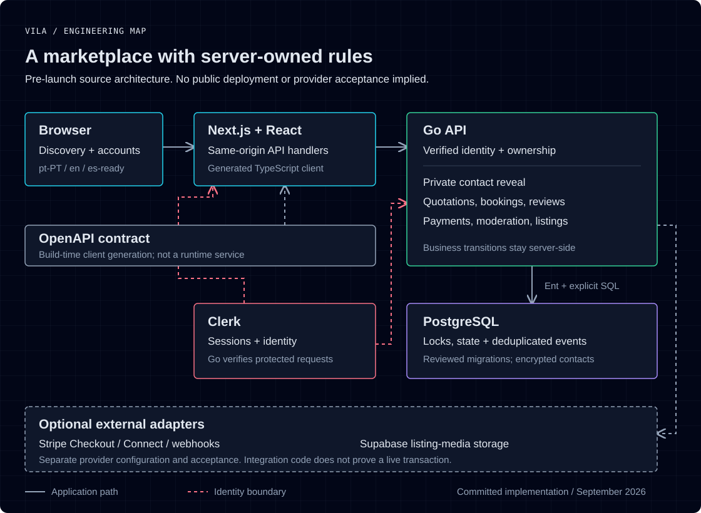

# Vila

A local-services marketplace for Portugal, starting with rural communities. Customers find nearby providers, request quotations and arrange bookings; providers manage listings and conversations through the account area.

**Status:** pre-launch product with implemented marketplace workflows. No verified public deployment is advertised. The diagram describes the committed architecture, not a hosted demo. The [published dependency audit](docs/publication-status.md#dependency-audit) has unresolved critical/high findings.



## Engineering focus

- Private contacts are encrypted at rest. Revealing one requires provider consent, server-side authorization and a transactional daily allowance; repeat requests do not create duplicate leads.
- Accepting a quotation locks its request and updates the accepted proposal, competing proposals and notifications in one PostgreSQL transaction.
- Clerk establishes identity. Go owns permissions, ownership checks and business transitions; a hidden UI control is never an authorization boundary.
- Booking payments have Stripe Checkout/Connect adapters, webhook verification and durable event deduplication. Integration code is not evidence of completed live payment acceptance.

## Stack

Next.js, React, TypeScript and next-intl on the frontend; Go, Ent, PostgreSQL and SQL transactions on the backend. A versioned OpenAPI contract generates the frontend client. Clerk handles identity, Supabase adapters handle listing-media storage, and Docker Compose describes local and production topologies.

Portuguese (Portugal) is the default locale, with English support and Spanish-ready resources.

## Explore the implementation

| Area | Source |
| --- | --- |
| Browser routes, account views and same-origin API handlers | [`frontend/`](frontend/) |
| Marketplace rules, persistence and integration adapters | [`backend/`](backend/) |
| Shared API contract | [`openapi/juntly-api.v1.yaml`](openapi/juntly-api.v1.yaml) |
| Database schema and migrations | [`supabase/migrations/`](supabase/migrations/) |
| Deployment, backups and recovery | [`docs/operations/`](docs/operations/) |

[Engineering decisions](docs/engineering.md) · [Local development](docs/local-development.md) · [Release boundaries](docs/publication-status.md) · [Architecture viewer](docs/assets/architecture.html)

## Run and verify

Use Node.js from [`.nvmrc`](.nvmrc) and the Go toolchain in [`backend/go.mod`](backend/go.mod).

```bash
npm --prefix frontend ci
npm --prefix frontend run verify
(cd backend && go test ./...)
```

Configure a development Clerk instance using the [setup guide](docs/local-development.md), then run `npm --prefix frontend run dev:local` and open `http://localhost:4200/`. Complete marketplace journeys also require the Go API and a migrated development database. Verification includes a dependency audit; an old CI result is not a current security report.

## Release boundaries

The repository includes discovery, listings, messaging, quotations, bookings, reviews, moderation and administrative views. The Newsprint redesign, launch-plan billing, email delivery and quota changes are separate unpublished work as of 24 September 2026. They are not included in this presentation update.

Public launch still needs deployment, legal/operator configuration and authenticated acceptance with external providers. Paid platform subscriptions and promotions must not be treated as active merely because a browser returns from Checkout. See the [dated status and evidence](docs/publication-status.md).

Vila was previously called Juntly. The GitHub repository uses `vila`; Go imports, `JUNTLY_*` configuration, the API filename, Supabase project ID and container image names retain their existing technical identifiers. This rename does not migrate data or infrastructure.

## License

No open-source license has been selected. Public visibility does not grant reuse, modification or redistribution rights beyond applicable law.
